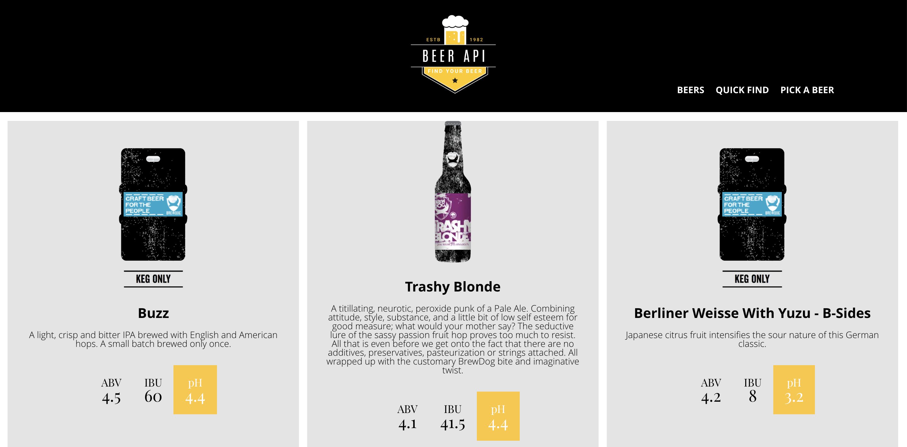
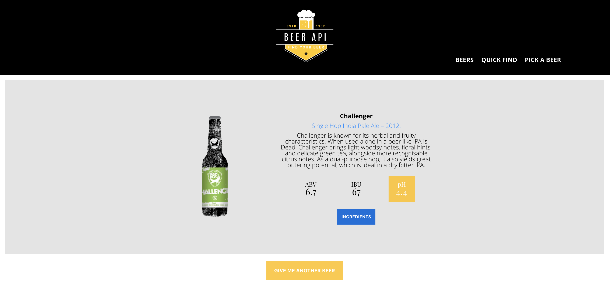
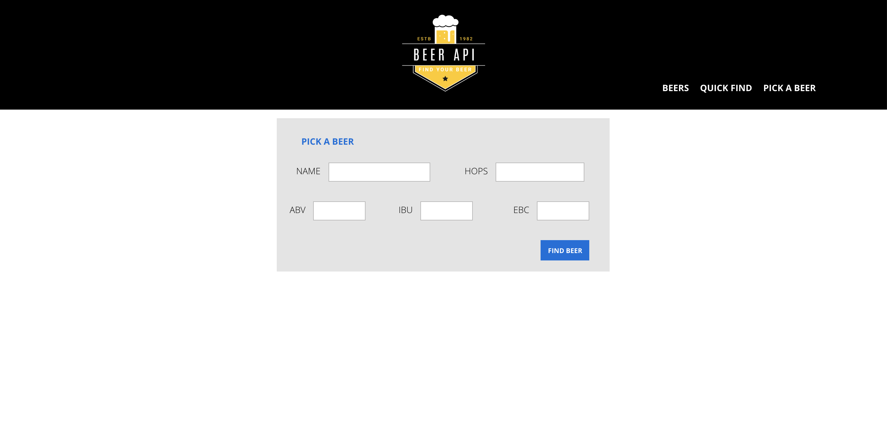

# Beer API Website Project
 
 
---
## 1.The Project
---
## 2.Used Tools
---
## 3.Personal Learnings
---
## 4.Website Link
---
## 5.Screenshots
 
 
---

## 1.The Project

The project consists of a beer guide wesite. The existant content is been requested through API's from Brewdog Beer Company. 
 
Following the project requirements, each page gives the user different types of detailed information about Brewdog beers. In the home page (also the "beer" button in the nav menu), the user is able to navigate around six pages showing different types of beers. The "quick find" section allows users to get random beers and also information about its ingredients. The "pick a beer" section is a form where the user can pick a specify beer by filling in the required information fields.
 
 

---
## 2.Used Tools

- HTML5
- CSS3
- Sass
- Ajax
- JavaScript
- jQuery
- Gulp
 
 

---
## 3.Personal Learnings

As the previous projects, I started building the base of my HTML and CSS files. I felt much more confident by practicing my existent skills. Also in this project I used SASS pre-processor to create a clearer CSS file applying variables, fonts and extensions. By using SASS for the second time in a project, I am now used to the way things are organised with it.
 
Using JS I managed to create ES2015 class constructor and methods, used the "new" for objects. Through Ajax I managed to get requests with API for "beers" page and "random" page.
 
 

----
## 4. Website Link

You can check the final result of my project by clicking [here](https://tonypossamai.github.io/beer-api/)
 
 

---
## 5.Screenshots

### Homepage

 
 

---
### Quick Find Section

 
 

---
### Pick a Beer Section

 
 
